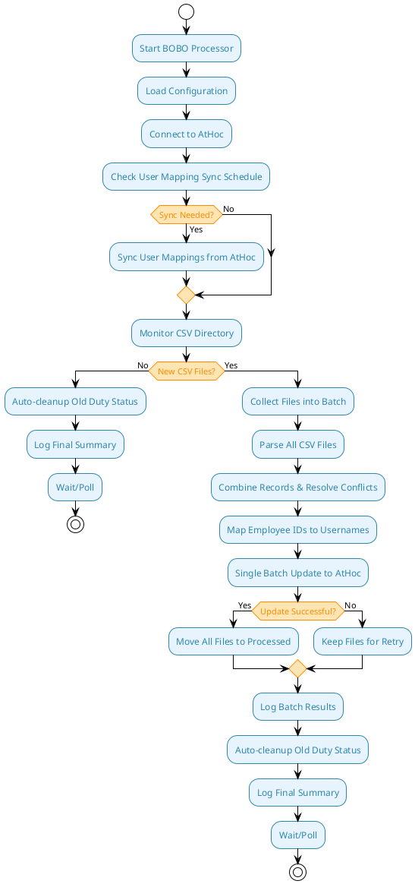

# BOBO AtHoc Integration Tool

A Python-based integration tool that processes BOBO worker duty status data and synchronizes it with AtHoc emergency notification systems.

## Overview

The BOBO processor monitors CSV files containing worker duty status information and automatically updates corresponding user records in AtHoc. This enables real-time tracking of who is on duty and available to receive emergency notifications.

## Key Features

- **🔄 Automated Processing**: Monitors CSV files and processes duty status updates automatically
- **📦 Intelligent Batching**: Groups multiple CSV files for efficient single-batch processing
- **👥 User Mapping**: Maintains a local database mapping employee IDs to AtHoc usernames
- **⏰ Scheduled Sync**: Daily user mapping synchronization with configurable timing
- **🛡️ Smart Error Handling**: Distinguishes between expected errors (user not found) and real failures
- **📁 Safe File Management**: Files only moved after successful AtHoc sync confirmation
- **📊 Comprehensive Logging**: Multi-level logging with automatic rotation and cleanup
- **🔍 Debug Logging**: Detailed JSON response logging for troubleshooting and monitoring
- **⚡ Batch Processing**: Efficient bulk updates to AtHoc using native APIs
- **🔒 Safe Updates**: Only modifies duty status fields, never changes user enable/disable status
- **🚫 Conflict Resolution**: Latest timestamp wins when multiple updates exist for same employee
- **🧹 Auto-Cleanup**: Automatically clears old duty status entries to prevent data accumulation

## System Requirements

- Python 3.7+
- Network access to AtHoc server
- Read access to BOBO CSV output files
- Write access for database and log files

## Project Structure

```
DMS_Python1/
├── bobosync/                    # Main application directory
│   ├── athoc_client.py          # AtHoc API client
│   ├── bobo_processor.py        # Main processing engine
│   ├── requirements.txt         # Python dependencies
│   ├── .env                     # Configuration file
│   ├── bobo_mapping.db          # SQLite database
│   ├── myenv/                   # Python virtual environment
│   ├── network_testing/         # Network testing utilities
│   ├── packages/                # Offline installation packages
│   ├── run_bobo_windows.bat     # Windows batch wrapper
│   └── run_bobo_windows.ps1     # PowerShell wrapper
├── logs/                        # Log files directory
├── processed_files/             # Successfully processed CSV files
└── failed_files/                # Files that exceeded retry attempts
```

## Installation

1. **Clone or download the project**
```bash
git clone <repository-url>
cd DMS_Python1/bobosync
```

2. **Set up virtual environment (Recommended)**
```bash
cd bobosync
python -m venv myenv
myenv\Scripts\activate
pip install -r requirements.txt
```

**Or install dependencies globally:**
```bash
pip install -r requirements.txt
```

### Offline / Air‑Gapped Installation (Recommended for customer servers)

If the target server cannot access the internet, pre-download wheels on a machine with internet access, copy them to the server, and install locally.

1) On a machine with internet access, download wheels into the `packages` folder:

```bash
# Example for Windows Server (64-bit) running CPython 3.11
cd bobosync
pip download -r requirements.txt \
  --platform win_amd64 \
  --only-binary=:all: \
  --implementation cp \
  --python-version 3.11 \
  -d ./packages
```

Examples for other environments (adjust platform and Python version):
- Windows (Python 3.13): `--platform win_amd64 --python-version 3.13`
- Linux x86_64 (Python 3.11): `--platform manylinux_2_28_x86_64 --python-version 3.11`
- macOS arm64 (Python 3.11): `--platform macosx_12_0_arm64 --python-version 3.11`

2) Copy the `packages/` directory to the target server (keep next to `requirements.txt`).

3) On the target server, set up virtual environment and install from local wheels (no internet):

```bash
cd bobosync
python -m venv myenv
myenv\Scripts\activate
pip install --no-index --find-links ./packages -r requirements.txt
```

Notes:
- Ensure the `--python-version` and `--platform` match the target server’s Python and OS.
- Re-run the download step if you change Python version or platform.

3. **Configure environment**
```bash
cp .env_safe .env
# Edit .env with your specific configuration values
# The .env_safe template now includes all necessary settings with documentation
```

## Configuration

### Environment Variables (.env file)

**Note:** The `.env_safe` template now contains all necessary configuration variables with comprehensive documentation and setup instructions.

#### **Complete Configuration Template (all included in .env_safe)**

The `.env_safe` file includes organized sections for:
- **AtHoc API Authentication** - Server URL, credentials, OAuth2 settings
- **SSL and Security Settings** - Certificate verification options
- **Logging Configuration** - Log levels, directories, retention
- **File Processing Settings** - CSV directories, batch sizes, file management
- **Database Configuration** - SQLite database settings
- **User Mapping Sync Settings** - Automatic sync scheduling
- **AtHoc Field Mappings** - Critical field name mappings (must match your AtHoc instance)
- **Maintenance Settings** - Automatic cleanup configurations

#### **Critical Configuration Notes**

**AtHoc Field Mappings (Most Important):**
- `DUTY_STATUS_FIELD` - Must exactly match your AtHoc duty status field name
- `COLLAR_ID_FIELD` - Must match the AtHoc field containing worker IDs
- `USER_ATTRIBUTES` - Must include all fields needed for mapping

**File Processing:**
- `CSV_DIRECTORY` - Path to your BOBO CSV files
- `MOVE_PROCESSED_FILES` - Set to `false` for testing, `true` for production

**For complete configuration details, see the comprehensive `.env_safe` template file which includes:**
- Detailed descriptions for every setting
- Setup instructions and verification checklist
- Testing vs. production recommendations
- Field verification requirements

## Usage

### Basic Operation

**Using Virtual Environment (Recommended):**
```bash
cd bobosync
myenv\Scripts\python bobo_processor.py
```

**Or activate virtual environment first:**
```bash
cd bobosync
myenv\Scripts\Activate.ps1
python bobo_processor.py
```

**Using Windows Wrapper Scripts:**
```bash
cd bobosync
.\run_bobo_windows.bat        # Batch file wrapper
# OR
.\run_bobo_windows.ps1        # PowerShell wrapper
```

The processor will:
1. Connect to AtHoc and verify credentials
2. Check if user mapping sync is needed
3. Monitor for new CSV files in the configured directory
4. Process duty status updates and sync to AtHoc
5. **Auto-cleanup old duty status entries** (runs regardless of CSV file presence)
6. Log all activities and manage processed files

### Windows Automation
For automated execution on Windows, see the **[Windows Scheduler Setup Guide](windows_scheduler_setup.md)** which includes:
- Task Scheduler configuration for every minute execution
- PowerShell and Batch wrapper scripts
- Process management and error handling
- Performance optimization tips

### Network Testing and Troubleshooting
The project includes comprehensive network testing utilities in the `network_testing/` directory:

- **SSL Configuration Testing**: `test_ssl_verification.py`, `test_production_ssl.py`
- **Proxy Testing**: `test_proxy_connection.py`, `test_all_proxy_scenarios.py`
- **AtHoc Authentication**: `test_athoc_auth.py`
- **Debugging Tools**: `debug_proxy_config.py`, `ssl_fix_guide.py`
- **Documentation**: `CUSTOMER_SSL_GUIDE.md`, `PROXY_TESTING_GUIDE.md`

These tools help diagnose connectivity issues, SSL problems, and proxy configurations before deploying to production.

### Manual User Mapping Sync
```python
from bobo_processor import BOBOProcessor

processor = BOBOProcessor()
processor.connect_athoc()
processor.sync_worker_mappings()
```

## How It Works

### High-Level Process Flow



### Enhanced Batch Processing

The system now uses intelligent batching for optimal performance and data safety:

1. **File Collection**: All available CSV files are collected into a single processing batch
2. **Memory Processing**: Files are parsed and stored in memory without being moved
3. **Conflict Resolution**: When multiple records exist for the same employee, the latest timestamp wins
4. **Single API Call**: All updates are sent to AtHoc in one batch operation
5. **Safe File Handling**: Files are only moved to processed directory after successful AtHoc confirmation
6. **Retry Safety**: On failure, all files remain in source directory for next processing attempt

Benefits:
- **10x fewer API calls**: One batch update instead of per-file updates
- **Data Safety**: No file loss if sync fails
- **Consistency**: All updates applied atomically
- **Conflict Resolution**: Automatic handling of duplicate employee updates
- **Automatic Cleanup**: Old duty status entries are automatically cleared to prevent data accumulation

### Smart Error Handling

The system intelligently distinguishes between different types of errors to prevent unnecessary file retries:

**Expected Errors (Treated as Success):**
- **User Not Found**: When a user doesn't exist in AtHoc (prevents auto-creation)
- **Permission Denied**: When user exists but service account lacks update permissions

**Real Errors (Causes Retry):**
- **Network Issues**: Connection timeouts, DNS failures
- **API Errors**: Server errors, authentication failures
- **Data Validation**: Invalid field formats, missing required data

**Benefits:**
- **No False Failures**: Files with only "user not found" errors are processed successfully
- **Reduced Retry Load**: Only real errors cause files to be kept for retry
- **Better Monitoring**: Clear distinction between expected and unexpected issues
- **Data Integrity**: Prevents auto-creation of users while maintaining system reliability

### Data Flow

1. **BOBO CSV Input**: Worker duty status exported from BOBO system
   ```csv
   Transaction_Type,Employee_ID,Payroll_ID,Clocking_Date,Clocking_Time,DateTime_Created,Geo_Status,Geo_Latitude,Geo_Longitude,Geo_Accuracy
   BON,12345,PAY001,20240617,143000,20240617143000,1,40.7128,-74.0060,5.0
   BOF,67890,PAY002,20240617,143100,20240617143100,1,40.7128,-74.0060,5.0
   ```

2. **User Mapping Database**: Local SQLite database mapping employee IDs to AtHoc usernames
   ```sql
   employee_id | username              | collar_id | last_updated
   12345      | john.doe@company.com  | 12345     | 2024-06-17 20:00:00
   67890      | jane.smith@company.com| 67890     | 2024-06-17 20:00:00
   ```

3. **AtHoc User Update**: Duty status synchronized to AtHoc custom fields
   ```json
   {
     "LOGIN_ID": "john.doe@company.com",
     "On-Duty-DTG": "17/06/2024 14:30:00"
   }
   ```

## Detailed Process Guide

For comprehensive troubleshooting, detailed process flow analysis, and maintenance procedures, see the **[Process Guide](process.md)**. This guide includes:

- **Step-by-step process flow** with specific code locations
- **Detailed troubleshooting procedures** for common issues
- **Monitoring checklists** for daily, weekly, and monthly maintenance
- **Emergency procedures** for system failures
- **Performance optimization** guidance

### User Mapping Sync Schedule

The system automatically syncs user mappings from AtHoc on the following schedule:

- **Daily**: After configured hour (default: 8pm) and not already done today
- **Immediate**: If more than configured days (default: 2) since last successful sync
- **Retry**: If last sync returned no data or encountered errors
- **First Run**: If never synced before

### Auto-Cleanup Functionality

The system automatically cleans up old duty status entries to prevent data accumulation:

- **Always Runs**: Auto-cleanup executes regardless of whether CSV files are found
- **Configurable Threshold**: Clears duty status entries older than specified hours (default: 24 hours)
- **Safe Operation**: Only clears duty status fields, never affects user enable/disable status
- **Batch Processing**: Efficiently processes multiple users in a single API call
- **Logging**: All cleanup operations are logged for audit purposes

**Configuration:**
- `AUTO_CLEANUP_HOURS`: Hours after which duty status is considered old (default: 24)
- `DUTY_STATUS_FIELD`: Field name to clear (must match AtHoc configuration)

**Benefits:**
- Prevents stale duty status data from accumulating
- Maintains data accuracy in AtHoc
- Reduces manual maintenance requirements
- Ensures only current duty status is displayed

## Database Structure

### Worker Mappings Table
```sql
CREATE TABLE worker_mapping (
    employee_id TEXT PRIMARY KEY,
    username TEXT NOT NULL,
    collar_id TEXT,
    last_updated TIMESTAMP DEFAULT CURRENT_TIMESTAMP
);
```

### Processing Log Table
```sql
CREATE TABLE processing_log (
    id INTEGER PRIMARY KEY AUTOINCREMENT,
    filename TEXT NOT NULL,
    processed_at TIMESTAMP DEFAULT CURRENT_TIMESTAMP,
    entries_processed INTEGER,
    success_count INTEGER,
    error_count INTEGER,
    errors TEXT
);
```

### Sync Tracking Table
```sql
CREATE TABLE sync_tracking (
    sync_type TEXT PRIMARY KEY,
    last_sync_date DATE,
    last_sync_time TIMESTAMP,
    status TEXT
);
```

## Logging

The system provides comprehensive logging capabilities with multiple levels and detailed monitoring features.

### Log Files
- **Location**: Configurable via `LOG_DIRECTORY`
- **Rotation**: Daily at midnight
- **Retention**: Configurable via `LOG_PURGE_DAYS`
- **Format**: `bobo_processor.log` (current), `bobo_processor.log.YYYY-MM-DD` (historical)

### Debug Logging and Monitoring

Enhanced logging capabilities provide detailed visibility into system operations:

**Debug Mode Features:**
- **Complete JSON Responses**: Full AtHoc API responses with detailed error information
- **Individual User Results**: Per-user sync status, error details, and user IDs
- **Error Classification**: Automatic categorization of expected vs. unexpected errors
- **Decision Logging**: Clear indication of why certain errors are treated as success

**Enable Debug Logging:**
```bash
# Set in .env file
LOG_LEVEL=DEBUG

# Or set environment variable
set LOG_LEVEL=DEBUG
myenv\Scripts\python bobo_processor.py
```

**Debug Output Example:**
```
DEBUG: AtHoc sync_users_by_common_names JSON response: [
  {
    "LOGIN_ID": "user@company.com",
    "On-Duty-DTG": "22/10/2025 07:41:42",
    ":SyncStatus": "OK",
    ":SyncDetails": "Updated",
    "USER_ID": 2060074
  },
  {
    "LOGIN_ID": "nonexistent@company.com",
    "On-Duty-DTG": "22/10/2025 07:41:44",
    ":SyncStatus": "Error",
    ":SyncDetails": "User: nonexistent@company.com does not exists in the Organization",
    "USER_ID": null
  }
]
Expected: User nonexistent@company.com not found in AtHoc (will be treated as success)
DEBUG: Treating 'user does not exist' as success for nonexistent@company.com
```

**Debug Logging Benefits:**
- **Complete Visibility**: See exactly what AtHoc returns for each operation
- **Easy Troubleshooting**: Identify specific issues without guessing
- **Performance Monitoring**: Track API response times and success rates
- **Data Validation**: Verify that expected errors are handled correctly

### Log Levels
- **INFO**: 
  - System startup and shutdown
  - Batch processing summaries
  - User mapping sync operations
  - File management operations
  - Configuration validation
  - Auto-cleanup operations and results
  - Error classification (expected vs. unexpected)
- **DEBUG**: 
  - Complete AtHoc API JSON responses
  - Individual user sync details and decisions
  - User mapping details per user
  - File parsing details
  - Auto-cleanup user details
  - Error handling logic and decisions
  - Detailed API request/response logging
- **WARNING**: 
  - Non-critical errors
  - Missing user mappings
  - API warnings
  - Configuration deprecations
  - Auto-cleanup warnings
  - Expected errors (user not found, etc.)
- **ERROR**: 
  - Processing failures
  - Connection issues
  - Critical system errors
  - Data validation failures
  - Auto-cleanup failures
  - Unexpected API errors

**Production Recommendation**: Use INFO level to avoid massive log files while maintaining visibility into operational status. Use DEBUG level for troubleshooting and detailed monitoring.

## Troubleshooting

**For comprehensive troubleshooting procedures, see the [Process Guide](bobosync/process.md) which includes detailed diagnostic steps, code locations, and emergency procedures.**

**Important**: Always use the virtual environment when running the application to avoid dependency issues:
```bash
cd bobosync
myenv\Scripts\python bobo_processor.py
```

### Quick Reference - Common Issues

#### Connection Problems
```bash
# Check AtHoc connectivity
curl -k https://your-athoc-server.com/api/health

# Verify SSL settings
DISABLE_SSL_VERIFY=true  # For development environments only
```

#### User Mapping Issues
```bash
# Check user attributes configuration
USER_ATTRIBUTES=Collar-Number,FIRSTNAME,LASTNAME

# Verify field names in AtHoc match configuration
COLLAR_ID_FIELD=Collar-Number
DUTY_STATUS_FIELD=On-Duty-DTG
```

#### File Processing Problems
```bash
# Ensure CSV directory exists and is readable
ls -la /path/to/csv/directory

# Check file permissions
chmod 755 /path/to/csv/directory

# Verify files aren't moved prematurely
# Files should only be in processed directory after successful AtHoc sync
```

#### Batch Processing Issues
```bash
# Check if files are stuck in source directory
# This indicates AtHoc sync failures - check logs for API errors

# Verify BATCH_SIZE isn't too large for AtHoc server
BATCH_SIZE=10  # Reduce if getting timeout errors

# Check for timestamp format issues
# CSV timestamps must be parseable for conflict resolution

# Enable debug logging to see detailed API responses
LOG_LEVEL=DEBUG
```

#### Error Handling and File Processing
```bash
# Files with "user not found" errors should now process successfully
# Check logs for "Expected: User not found" messages - these are normal

# Real errors that cause retries include:
# - Network connectivity issues
# - Authentication failures
# - Server errors (5xx responses)
# - Invalid data formats

# Enable debug logging to see error classification
LOG_LEVEL=DEBUG
```

### Debug Mode
Enable detailed logging by setting environment variable:
```bash
# Using virtual environment (recommended)
cd bobosync
myenv\Scripts\python bobo_processor.py

# With debug logging
set LOG_LEVEL=DEBUG
myenv\Scripts\python bobo_processor.py

# Or modify code for persistent debug logging
logging.getLogger().setLevel(logging.DEBUG)
```

### Manual Testing
```bash
# First, navigate to the bobosync directory and activate virtual environment
cd bobosync
myenv\Scripts\activate
```

```python
# Test AtHoc connection
from athoc_client import AtHocClient
client = AtHocClient()
print("Connection successful!")

# Test user mapping
from bobo_processor import BOBOProcessor
processor = BOBOProcessor()
users = processor.athoc_client.get_all_users_with_attributes(['Collar-Number'])
print(f"Found {len(users)} users")

# Test batch processing
batch_files = processor.collect_csv_files()
print(f"Found {len(batch_files)} files to process")
```

## Security Considerations

- Store `.env` file securely and never commit to version control
- Use service accounts with minimal required permissions
- Enable SSL verification in production environments
- Regularly rotate AtHoc credentials
- Monitor log files for suspicious activity
- **Safe User Management**: Tool only updates duty status fields and respects existing user enable/disable states
- **Data Integrity**: Batch processing ensures all-or-nothing updates to prevent partial data corruption
- **File Safety**: Files remain available for retry if AtHoc sync fails

## Performance

### Optimization Settings
- **BATCH_SIZE**: Adjust based on AtHoc server capacity (default: 10)
- **SYNC_HOUR**: Schedule during low-traffic periods
- **AUTO_CLEANUP_HOURS**: Balance between accuracy and performance
- **LOG_LEVEL**: Use INFO in production to minimize log file size

### Monitoring
- Monitor log files for batch processing times and success rates
- Track user mapping sync success rates
- Monitor AtHoc API response times and error rates
- Set up alerts for processing failures and file accumulation
- **Batch Efficiency**: Monitor API call reduction from batch processing
- **Auto-Cleanup**: Monitor cleanup operations and success rates
- **Data Freshness**: Track duty status age and cleanup effectiveness
- **Error Classification**: Monitor expected vs. unexpected error rates
- **File Processing**: Track files processed successfully vs. kept for retry
- **Debug Logging**: Use DEBUG level for detailed API response monitoring

### Performance Benefits
- **Reduced API Load**: Single batch call vs. multiple individual calls
- **Faster Processing**: Memory-based file handling vs. disk I/O per file
- **Network Efficiency**: Fewer HTTP requests to AtHoc server
- **Atomic Operations**: All updates succeed or fail together
- **Reduced Retry Load**: Only real errors cause file retries, not expected "user not found" errors
- **Better Resource Utilization**: Files process successfully even with non-existent users
- **Improved Monitoring**: Clear visibility into system behavior with debug logging

## Support

For issues and questions:
1. **First**: Check the **[Process Guide](bobosync/process.md)** for detailed troubleshooting procedures
2. **Virtual Environment**: Ensure you're using the virtual environment to avoid dependency issues
3. Check log files for error details (focus on INFO/ERROR levels)
4. Verify configuration against this documentation
5. Test individual components manually using the examples in the Process Guide
6. Review AtHoc API documentation for field mappings
7. **Batch Issues**: Check if files are accumulating in source directory indicating sync failures
8. **Network Issues**: Use the network testing utilities in `bobosync/network_testing/` directory

## Documentation

- **[Process Guide](bobosync/process.md)** - Comprehensive troubleshooting and maintenance guide
- **[Windows Scheduler Setup](bobosync/windows_scheduler_setup.md)** - Complete guide for Windows Task Scheduler automation
- **[Network Testing Guide](bobosync/network_testing/README.md)** - Network and SSL troubleshooting utilities
- **This README** - Quick start and configuration reference 