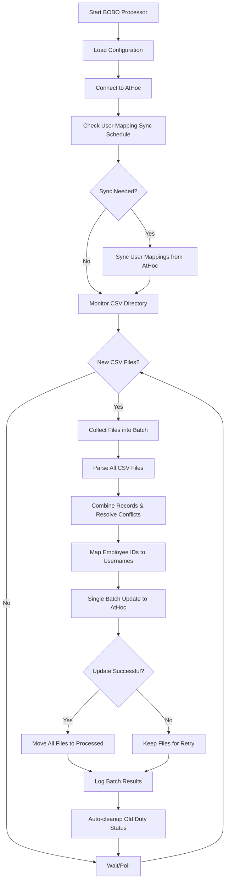

# BOBO AtHoc Integration Tool

A Python-based integration tool that processes BOBO worker duty status data and synchronizes it with AtHoc emergency notification systems.

## Overview

The BOBO processor monitors CSV files containing worker duty status information and automatically updates corresponding user records in AtHoc. This enables real-time tracking of who is on duty and available to receive emergency notifications.

## Key Features

- **🔄 Automated Processing**: Monitors CSV files and processes duty status updates automatically
- **📦 Intelligent Batching**: Groups multiple CSV files for efficient single-batch processing
- **👥 User Mapping**: Maintains a local database mapping employee IDs to AtHoc usernames
- **⏰ Scheduled Sync**: Daily user mapping synchronization with configurable timing
- **🛡️ Error Recovery**: Robust error handling with automatic retries and logging
- **📁 Safe File Management**: Files only moved after successful AtHoc sync confirmation
- **📊 Comprehensive Logging**: Multi-level logging with automatic rotation and cleanup
- **⚡ Batch Processing**: Efficient bulk updates to AtHoc using native APIs
- **🔒 Safe Updates**: Only modifies duty status fields, never changes user enable/disable status
- **🚫 Conflict Resolution**: Latest timestamp wins when multiple updates exist for same employee

## System Requirements

- Python 3.7+
- Network access to AtHoc server
- Read access to BOBO CSV output files
- Write access for database and log files

## Project Structure

```
bobosync/
├── athoc_client.py              # AtHoc API client library
├── bobo_processor.py            # Main processing engine
├── requirements.txt             # Python dependencies
├── .env_safe                   # Configuration template
├── process.md                  # Detailed process guide (see this for troubleshooting)
├── windows_scheduler_setup.md  # Windows Task Scheduler setup guide
├── run_bobo_windows.ps1        # PowerShell wrapper for Windows automation
├── run_bobo_windows.bat        # Batch wrapper for Windows automation
├── bobo_mapping.db             # SQLite database (created automatically)
└── .env                        # Your configuration (create from .env_safe)
```

## Installation

1. **Clone or download the project**
```bash
git clone <repository-url>
cd dms_python/bobosync
```

2. **Install dependencies**
```bash
pip install -r requirements.txt
```

3. **Configure environment**
```bash
cp .env_safe .env
# Edit .env with your specific configuration values
# The .env_safe template now includes all necessary settings with documentation
```

## Configuration

### Environment Variables (.env file)

**Note:** The `.env_safe` template now contains all necessary configuration variables with comprehensive documentation and setup instructions.

#### **Complete Configuration Template (all included in .env_safe)**

The `.env_safe` file includes organized sections for:
- **AtHoc API Authentication** - Server URL, credentials, OAuth2 settings
- **SSL and Security Settings** - Certificate verification options
- **Logging Configuration** - Log levels, directories, retention
- **File Processing Settings** - CSV directories, batch sizes, file management
- **Database Configuration** - SQLite database settings
- **User Mapping Sync Settings** - Automatic sync scheduling
- **AtHoc Field Mappings** - Critical field name mappings (must match your AtHoc instance)
- **Maintenance Settings** - Automatic cleanup configurations

#### **Critical Configuration Notes**

**AtHoc Field Mappings (Most Important):**
- `DUTY_STATUS_FIELD` - Must exactly match your AtHoc duty status field name
- `COLLAR_ID_FIELD` - Must match the AtHoc field containing worker IDs
- `USER_ATTRIBUTES` - Must include all fields needed for mapping

**File Processing:**
- `CSV_DIRECTORY` - Path to your BOBO CSV files
- `MOVE_PROCESSED_FILES` - Set to `false` for testing, `true` for production

**For complete configuration details, see the comprehensive `.env_safe` template file which includes:**
- Detailed descriptions for every setting
- Setup instructions and verification checklist
- Testing vs. production recommendations
- Field verification requirements

## Usage

### Basic Operation
```bash
cd bobosync
python bobo_processor.py
```

The processor will:
1. Connect to AtHoc and verify credentials
2. Check if user mapping sync is needed
3. Monitor for new CSV files in the configured directory
4. Process duty status updates and sync to AtHoc
5. Log all activities and manage processed files

### Windows Automation
For automated execution on Windows, see the **[Windows Scheduler Setup Guide](windows_scheduler_setup.md)** which includes:
- Task Scheduler configuration for every minute execution
- PowerShell and Batch wrapper scripts
- Process management and error handling
- Performance optimization tips

### Manual User Mapping Sync
```python
from bobo_processor import BOBOProcessor

processor = BOBOProcessor()
processor.connect_athoc()
processor.sync_worker_mappings()
```

## How It Works

### High-Level Process Flow



### Enhanced Batch Processing

The system now uses intelligent batching for optimal performance and data safety:

1. **File Collection**: All available CSV files are collected into a single processing batch
2. **Memory Processing**: Files are parsed and stored in memory without being moved
3. **Conflict Resolution**: When multiple records exist for the same employee, the latest timestamp wins
4. **Single API Call**: All updates are sent to AtHoc in one batch operation
5. **Safe File Handling**: Files are only moved to processed directory after successful AtHoc confirmation
6. **Retry Safety**: On failure, all files remain in source directory for next processing attempt

Benefits:
- **10x fewer API calls**: One batch update instead of per-file updates
- **Data Safety**: No file loss if sync fails
- **Consistency**: All updates applied atomically
- **Conflict Resolution**: Automatic handling of duplicate employee updates

### Data Flow

1. **BOBO CSV Input**: Worker duty status exported from BOBO system
   ```csv
   Employee_ID,Status,Timestamp
   12345,On Duty,2024-06-17 14:30:00
   67890,Off Duty,2024-06-17 14:31:00
   ```

2. **User Mapping Database**: Local SQLite database mapping employee IDs to AtHoc usernames
   ```sql
   employee_id | username              | collar_id | last_updated
   12345      | john.doe@company.com  | 12345     | 2024-06-17 20:00:00
   67890      | jane.smith@company.com| 67890     | 2024-06-17 20:00:00
   ```

3. **AtHoc User Update**: Duty status synchronized to AtHoc custom fields
   ```json
   {
     "LOGIN_ID": "john.doe@company.com",
     "On-Duty-DTG": "17/06/2024 14:30:00"
   }
   ```

## Detailed Process Guide

For comprehensive troubleshooting, detailed process flow analysis, and maintenance procedures, see the **[Process Guide](process.md)**. This guide includes:

- **Step-by-step process flow** with specific code locations
- **Detailed troubleshooting procedures** for common issues
- **Monitoring checklists** for daily, weekly, and monthly maintenance
- **Emergency procedures** for system failures
- **Performance optimization** guidance

### User Mapping Sync Schedule

The system automatically syncs user mappings from AtHoc on the following schedule:

- **Daily**: After configured hour (default: 8pm) and not already done today
- **Immediate**: If more than configured days (default: 2) since last successful sync
- **Retry**: If last sync returned no data or encountered errors
- **First Run**: If never synced before

## Database Structure

### Worker Mappings Table
```sql
CREATE TABLE worker_mapping (
    employee_id TEXT PRIMARY KEY,
    username TEXT NOT NULL,
    collar_id TEXT,
    last_updated TIMESTAMP DEFAULT CURRENT_TIMESTAMP
);
```

### Processing Log Table
```sql
CREATE TABLE processing_log (
    id INTEGER PRIMARY KEY AUTOINCREMENT,
    filename TEXT NOT NULL,
    processed_at TIMESTAMP DEFAULT CURRENT_TIMESTAMP,
    entries_processed INTEGER,
    success_count INTEGER,
    error_count INTEGER,
    errors TEXT
);
```

### Sync Tracking Table
```sql
CREATE TABLE sync_tracking (
    sync_type TEXT PRIMARY KEY,
    last_sync_date DATE,
    last_sync_time TIMESTAMP,
    status TEXT
);
```

## Logging

### Log Files
- **Location**: Configurable via `LOG_DIRECTORY`
- **Rotation**: Daily at midnight
- **Retention**: Configurable via `LOG_PURGE_DAYS`
- **Format**: `bobo_processor.log` (current), `bobo_processor.log.YYYY-MM-DD` (historical)

### Log Levels
- **INFO**: 
  - System startup and shutdown
  - Batch processing summaries
  - User mapping sync operations
  - File management operations
  - Configuration validation
- **DEBUG**: 
  - Individual user sync details
  - Detailed API responses
  - User mapping details per user
  - File parsing details
- **WARNING**: 
  - Non-critical errors
  - Missing user mappings
  - API warnings
  - Configuration deprecations
- **ERROR**: 
  - Processing failures
  - Connection issues
  - Critical system errors
  - Data validation failures

**Production Recommendation**: Use INFO level to avoid massive log files from individual user sync entries while maintaining visibility into operational status.

## Troubleshooting

**For comprehensive troubleshooting procedures, see the [Process Guide](process.md) which includes detailed diagnostic steps, code locations, and emergency procedures.**

### Quick Reference - Common Issues

#### Connection Problems
```bash
# Check AtHoc connectivity
curl -k https://your-athoc-server.com/api/health

# Verify SSL settings
DISABLE_SSL_VERIFY=true  # For development environments only
```

#### User Mapping Issues
```bash
# Check user attributes configuration
USER_ATTRIBUTES=Collar-Number,FIRSTNAME,LASTNAME

# Verify field names in AtHoc match configuration
COLLAR_ID_FIELD=Collar-Number
DUTY_STATUS_FIELD=On-Duty-DTG
```

#### File Processing Problems
```bash
# Ensure CSV directory exists and is readable
ls -la /path/to/csv/directory

# Check file permissions
chmod 755 /path/to/csv/directory

# Verify files aren't moved prematurely
# Files should only be in processed directory after successful AtHoc sync
```

#### Batch Processing Issues
```bash
# Check if files are stuck in source directory
# This indicates AtHoc sync failures - check logs for API errors

# Verify BATCH_SIZE isn't too large for AtHoc server
BATCH_SIZE=10  # Reduce if getting timeout errors

# Check for timestamp format issues
# CSV timestamps must be parseable for conflict resolution
```

### Debug Mode
Enable detailed logging by setting environment variable:
```bash
# Temporary debug logging
export LOG_LEVEL=DEBUG
python bobo_processor.py

# Or modify code for persistent debug logging
logging.getLogger().setLevel(logging.DEBUG)
```

### Manual Testing
```python
# Test AtHoc connection
from athoc_client import AtHocClient
client = AtHocClient()
print("Connection successful!")

# Test user mapping
from bobo_processor import BOBOProcessor
processor = BOBOProcessor()
users = processor.athoc_client.get_all_users_with_attributes(['Collar-Number'])
print(f"Found {len(users)} users")

# Test batch processing
batch_files = processor.collect_csv_files()
print(f"Found {len(batch_files)} files to process")
```

## Security Considerations

- Store `.env` file securely and never commit to version control
- Use service accounts with minimal required permissions
- Enable SSL verification in production environments
- Regularly rotate AtHoc credentials
- Monitor log files for suspicious activity
- **Safe User Management**: Tool only updates duty status fields and respects existing user enable/disable states
- **Data Integrity**: Batch processing ensures all-or-nothing updates to prevent partial data corruption
- **File Safety**: Files remain available for retry if AtHoc sync fails

## Performance

### Optimization Settings
- **BATCH_SIZE**: Adjust based on AtHoc server capacity (default: 10)
- **SYNC_HOUR**: Schedule during low-traffic periods
- **AUTO_CLEANUP_HOURS**: Balance between accuracy and performance
- **LOG_LEVEL**: Use INFO in production to minimize log file size

### Monitoring
- Monitor log files for batch processing times and success rates
- Track user mapping sync success rates
- Monitor AtHoc API response times and error rates
- Set up alerts for processing failures and file accumulation
- **Batch Efficiency**: Monitor API call reduction from batch processing

### Performance Benefits
- **Reduced API Load**: Single batch call vs. multiple individual calls
- **Faster Processing**: Memory-based file handling vs. disk I/O per file
- **Network Efficiency**: Fewer HTTP requests to AtHoc server
- **Atomic Operations**: All updates succeed or fail together

## Support

For issues and questions:
1. **First**: Check the **[Process Guide](process.md)** for detailed troubleshooting procedures
2. Check log files for error details (focus on INFO/ERROR levels)
3. Verify configuration against this documentation
4. Test individual components manually using the examples in the Process Guide
5. Review AtHoc API documentation for field mappings
6. **Batch Issues**: Check if files are accumulating in source directory indicating sync failures

## Documentation

- **[Process Guide](process.md)** - Comprehensive troubleshooting and maintenance guide
- **[Windows Scheduler Setup](windows_scheduler_setup.md)** - Complete guide for Windows Task Scheduler automation
- **[Integration Documentation](../BOBO_AtHoc_Integration_Documentation.txt)** - Complete technical documentation
- **This README** - Quick start and configuration reference 