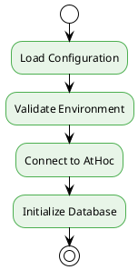
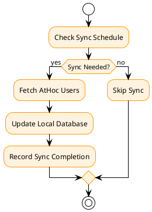
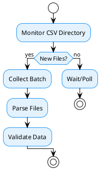
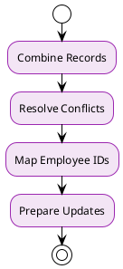
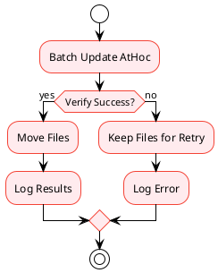
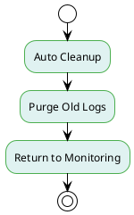
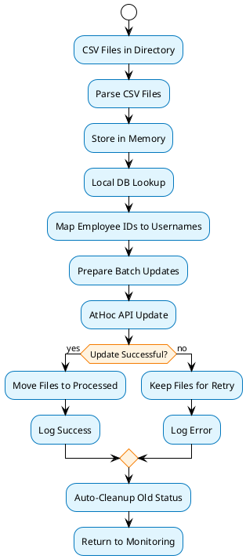

# BOBO Sync Process Guide

## Overview
The BOBO Sync system processes worker duty status CSV files from the BOBO system and synchronizes them with AtHoc emergency notification systems. This guide explains the complete flow through the scripts and provides troubleshooting guidance.

## System Architecture

### Core Components
1. **`athoc_client.py`** - Generic AtHoc API client library
2. **`bobo_processor.py`** - Main processing engine
3. **SQLite Database** - Local mapping storage (`bobo_mapping.db`)
4. **Configuration** - Environment variables (`.env` file)

## Detailed Process Flow

### 1. Initialization Phase



**What Happens:**
- Loads `.env` file from the same directory as the script
- Validates all required environment variables are present
- Creates a requests session with TLS 1.2 enforcement
- Authenticates with AtHoc OAuth2 server
- Initializes SQLite database for worker mapping

**Key Components:**
- `BOBOProcessor.__init__()` - Main initialization
- `AtHocClient._get_auth_token()` - Authentication
- `BOBODatabase.init_database()` - Database setup

### 2. User Mapping Sync Phase



**What Happens:**
- Checks if daily user mapping sync is due (configurable time)
- Fetches all users with specified attributes from AtHoc
- Updates local SQLite database with employee_id to username mappings
- Records sync completion in tracking table

**Key Components:**
- `BOBOProcessor.should_run_user_mapping_sync()` - Schedule check
- `AtHocClient.get_all_users_with_attributes()` - AtHoc user fetch
- `BOBODatabase.update_mapping()` - Local database update

### 3. File Monitoring Phase



**What Happens:**
- Continuously monitors the configured CSV directory
- Collects all available CSV files into a single processing batch
- Parses each CSV file into `BOBOEntry` objects
- Validates CSV format and data integrity

**Key Components:**
- `BOBOProcessor.get_csv_files()` - File discovery
- `BOBOProcessor.parse_csv_file()` - CSV parsing
- `BOBOEntry.from_csv_row()` - Data validation

### 4. Data Processing Phase



**What Happens:**
- Combines all CSV records from the batch
- Resolves conflicts (latest timestamp wins for same employee)
- Maps employee IDs to AtHoc usernames using local database
- Prepares duty status updates for AtHoc

**Key Components:**
- `BOBOProcessor.process_file_batch()` - Main processing logic
- `BOBODatabase.get_username_by_employee_id()` - Username lookup
- Conflict resolution logic (latest timestamp wins)

### 5. AtHoc Synchronization Phase



**What Happens:**
- Sends all duty status updates to AtHoc in a single batch API call
- Verifies successful update from AtHoc response
- Only moves files to processed directory after successful sync
- Logs batch processing results

**Key Components:**
- `AtHocClient.batch_update_duty_status()` - AtHoc API call
- `BOBOProcessor.move_processed_file()` - File management
- `BOBODatabase.log_processing()` - Result logging

### 6. Auto-Cleanup Phase



**What Happens:**
- **Always runs** regardless of whether CSV files are found
- Automatically clears old duty status records from AtHoc (configurable threshold)
- Purges old log files based on retention settings
- Returns to file monitoring phase

**Key Components:**
- `AtHocClient.clear_old_duty_status()` - AtHoc cleanup
- `AtHocClient.query_users_with_old_duty_status()` - Find old entries
- `AtHocClient.batch_update_duty_status()` - Clear old entries
- `BOBOProcessor._purge_old_logs()` - Log cleanup

**Configuration:**
- `AUTO_CLEANUP_HOURS`: Hours after which duty status is considered old (default: 24)
- `DUTY_STATUS_FIELD`: Field name to clear (must match AtHoc configuration)

**Benefits:**
- Prevents stale duty status data from accumulating
- Maintains data accuracy in AtHoc
- Reduces manual maintenance requirements
- Ensures only current duty status is displayed

## Data Flow Diagram



## Key Configuration Points

### Environment Variables (.env file)
- **AtHoc Connection**: SERVER_URL, CLIENT_ID, CLIENT_SECRET, USERNAME, PASSWORD, ORG_CODE
- **Data Processing**: CSV_DIRECTORY, DUTY_STATUS_FIELD, BATCH_SIZE
- **User Mapping**: USER_ATTRIBUTES, SYNC_HOUR, SYNC_RETRY_DAYS
- **File Management**: PROCESSED_DIRECTORY, MOVE_PROCESSED_FILES
- **Auto-Cleanup**: AUTO_CLEANUP_HOURS, DUTY_STATUS_FIELD
- **Security**: DISABLE_SSL_VERIFY, SCOPE

### Database Tables
- **worker_mapping**: employee_id → username mappings
- **processing_log**: File processing history
- **sync_tracking**: User mapping sync status

## Troubleshooting Guide

### Authentication Issues

**Symptoms:**
- "Failed to get AtHoc authentication token" error
- HTTP 401 Unauthorized responses
- Connection timeouts during auth

**Areas to Check:**
1. **Environment Variables**:
   ```bash
   # Verify all required variables are set
   grep -E "(ATHOC_SERVER_URL|CLIENT_ID|CLIENT_SECRET|USERNAME|PASSWORD|ORG_CODE)" .env
   ```

2. **Network Connectivity**:
   ```bash
   # Test basic connectivity
   curl -I https://your-athoc-server.com
   ```

3. **SSL/TLS Issues**:
   - Check `DISABLE_SSL_VERIFY` setting
   - Verify TLS 1.2 support on target server
   - Look for SSL certificate warnings in logs

4. **Credentials**:
   - Verify username/password are correct
   - Check if account is locked or expired
   - Confirm ORG_CODE matches exactly

**Code Locations:**
- ```87:111:bobosync/athoc_client.py``` - Authentication logic
- ```95:114:bobosync/athoc_client.py``` - Token request

### CSV Processing Issues

**Symptoms:**
- "Error parsing CSV file" messages
- Files not being processed
- Empty batch processing

**Areas to Check:**
1. **File Format**:
   - Verify CSV has exactly 10 columns
   - Check for proper date/time formats (YYYYMMDD, HHMMSS)
   - Look for missing or extra commas

2. **File Permissions**:
   - Ensure read access to CSV directory
   - Check write access to processed directory

3. **File Naming**:
   - Files must be in CSV_DIRECTORY
   - Must have .csv extension

**Code Locations:**
- ```516:542:bobosync/bobo_processor.py``` - CSV parsing
- ```47:65:bobosync/bobo_processor.py``` - BOBOEntry validation

### Database Issues

**Symptoms:**
- "Database locked" errors
- Missing username mappings
- Sync tracking failures

**Areas to Check:**
1. **Database File**:
   - Check if `bobo_mapping.db` exists and is writable
   - Verify database isn't corrupted

2. **Mapping Data**:
   ```sql
   -- Check mapping count
   SELECT COUNT(*) FROM worker_mapping;
   
   -- Check recent sync
   SELECT * FROM sync_tracking WHERE sync_type = 'user_mapping';
   ```

3. **User Mapping Sync**:
   - Verify `USER_ATTRIBUTES` environment variable
   - Check AtHoc user search API permissions

**Code Locations:**
- ```69:103:bobosync/bobo_processor.py``` - Database initialization
- ```423:462:bobosync/bobo_processor.py``` - User mapping sync

### AtHoc API Issues

**Symptoms:**
- Batch update failures
- HTTP 500/502/503 errors
- Rate limiting messages

**Areas to Check:**
1. **API Permissions**:
   - Verify user has permission to update duty status
   - Check if duty status field exists in AtHoc

2. **Rate Limiting**:
   - Monitor for HTTP 429 responses
   - Adjust `BATCH_SIZE` if needed

3. **Field Configuration**:
   - Verify `DUTY_STATUS_FIELD` matches AtHoc field name
   - Check field data type and format

**Code Locations:**
- ```491:537:bobosync/athoc_client.py``` - Batch update logic
- ```567:609:bobosync/bobo_processor.py``` - Update processing

### File Management Issues

**Symptoms:**
- Files not moving to processed directory
- Files being processed multiple times
- Permission denied errors

**Areas to Check:**
1. **Directory Permissions**:
   - Write access to `PROCESSED_DIRECTORY`
   - Read access to `CSV_DIRECTORY`

2. **Configuration**:
   - Check `MOVE_PROCESSED_FILES` setting
   - Verify directory paths are correct

3. **Disk Space**:
   - Ensure adequate disk space for file operations

**Code Locations:**
- ```474:515:bobosync/bobo_processor.py``` - File movement logic

### Logging and Monitoring

**Log Locations:**
- **Main Log**: `../logs/bobo_processor.log`
- **Error Details**: Check log level settings
- **Database Log**: `processing_log` table

**Key Log Patterns to Monitor:**
- `ERROR` - Critical failures requiring attention
- `WARNING` - Potential issues or missing data
- `Batch processing completed` - Successful operations
- `Authentication successful` - Connectivity confirmation

**Debug Mode:**
- Set logging level to DEBUG in configuration
- Monitor network requests and responses
- Track timing of operations

### Performance Issues

**Symptoms:**
- Slow processing times
- Memory usage growth
- API timeouts

**Areas to Check:**
1. **Batch Size**:
   - Adjust `BATCH_SIZE` for optimal performance
   - Monitor AtHoc API response times

2. **Database Performance**:
   - Check database file size
   - Consider periodic database maintenance

3. **Memory Usage**:
   - Monitor large CSV file processing
   - Check for memory leaks in long-running processes

### Network and Connectivity

**Common Issues:**
- Firewall blocking AtHoc server
- Proxy configuration problems
- DNS resolution failures

**Diagnostic Steps:**
1. Test basic connectivity: `ping athoc-server.com`
2. Test HTTPS: `curl -I https://athoc-server.com`
3. Check proxy settings if applicable
4. Verify firewall rules allow outbound HTTPS

### Auto-Cleanup Issues

**Symptoms:**
- Old duty status entries not being cleared
- "Auto-cleanup" not running in logs
- Duty status data accumulating over time

**Areas to Check:**
1. **Configuration**:
   - Verify `AUTO_CLEANUP_HOURS` is set (default: 24)
   - Check `DUTY_STATUS_FIELD` matches AtHoc field name
   - Ensure cleanup runs regardless of CSV file presence

2. **AtHoc Permissions**:
   - Verify user has permission to update duty status fields
   - Check if duty status field exists and is writable
   - Test manual duty status updates

3. **Logging**:
   - Look for "Auto-cleanup" entries in logs
   - Check for cleanup success/failure messages
   - Monitor cleanup operation timing

**Code Locations:**
- ```601:630:bobosync/athoc_client.py``` - Auto-cleanup logic
- ```555:598:bobosync/athoc_client.py``` - Query old duty status
- ```506:552:bobosync/athoc_client.py``` - Batch update duty status

**Manual Testing:**
```python
# Test auto-cleanup functionality
from athoc_client import AtHocClient
client = AtHocClient()

# Query users with old duty status
old_users = client.query_users_with_old_duty_status("DUTY_STATUS", 24)
print(f"Found {len(old_users)} users with old duty status")

# Test cleanup
cleared_count = client.clear_old_duty_status("DUTY_STATUS", 24)
print(f"Cleared duty status for {cleared_count} users")
```

## Monitoring Checklist

### Daily Checks:
- [ ] User mapping sync completed successfully
- [ ] CSV files being processed without errors
- [ ] No authentication failures
- [ ] Log files within normal size limits
- [ ] Auto-cleanup operations completed successfully
- [ ] No accumulation of old duty status entries

### Weekly Checks:
- [ ] Database size reasonable
- [ ] Processed files directory manageable
- [ ] No accumulation of unprocessed files
- [ ] System performance acceptable
- [ ] Auto-cleanup effectiveness (check duty status age distribution)
- [ ] No stale duty status data in AtHoc

### Monthly Checks:
- [ ] Review error patterns in logs
- [ ] Validate mapping accuracy
- [ ] Check disk space usage
- [ ] Update credentials if needed

## Emergency Procedures

### Complete System Failure:
1. Check AtHoc server status
2. Verify network connectivity
3. Restart the processor service
4. Check recent log entries
5. Validate configuration files

### Data Inconsistency:
1. Stop processing
2. Backup current database
3. Force user mapping sync
4. Validate mapping data
5. Resume processing with monitoring

### File Processing Backlog:
1. Check for processing errors
2. Verify AtHoc connectivity
3. Process files manually if needed
4. Monitor batch sizes
5. Consider temporary rate limiting

### Auto-Cleanup Failure:
1. Check AtHoc connectivity and permissions
2. Verify `AUTO_CLEANUP_HOURS` configuration
3. Test manual cleanup using provided code examples
4. Check for duty status field configuration issues
5. Monitor cleanup operation logs for specific errors

This guide should be referenced whenever issues arise with the BOBO Sync system and updated as new issues or solutions are discovered. 